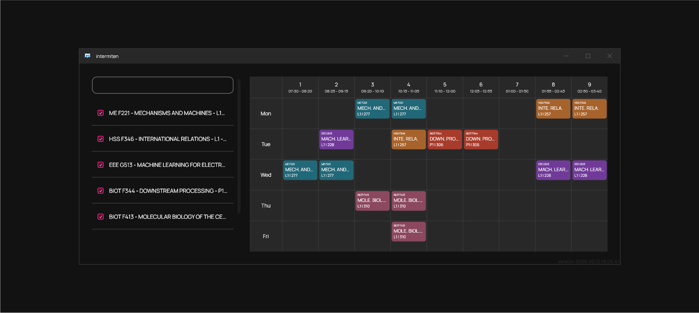

---

<h4 align="center"><i>A beautifully simple Timetable Visualizer for Windows 10</i></h4>

---

Intermiten is a minimalistic, open-source timetable visualizer, built for easy planning of courses for your academic semester, in Windows 10.

## Features

- **Visualize Courses** – Pick your desired courses and get a beautiful view of your semester timetable.
- **Avoid conflicts** – Check for any conflicts in class schedules before registration.
- **Find empty rooms** – Browse classrooms by their timetable, finding when certain classes are occupied or empty.
- **Meet professors** – View professors by their timetables, helping you plan your next chamber visit for any guidance.

## Installation

1. Download the latest `.zip` file for Intermiten from the [Releases Page](https://github.com/arcenter/Intermiten/releases/).
2. Extract the contents from the `Intermiten-XXX.zip` file that you downloaded.
3. Open the `Intermiten.exe` application from within the extracted folder.